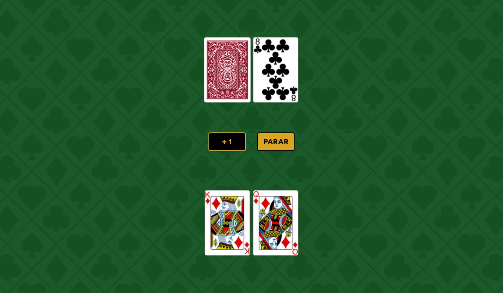

# Game Blackjack

## Sobre o projeto

Um jogo simples de balckjack, conhecido também como 21.

## Como jogar

Seu objetivo é fazer mais pontos que o dealer (seu adversário). Contanto que não ultrapasse os 21 pontos, que são contabilizados de acordo com as suas cartas.

Para pedir mais uma carta e somar mais pontos, basta clicar no botão <strong>+ 1</strong>, mas cuidado você perde se seus pontos forem maiores que 21. Caso esteja satisfeito com a sua pontuação, clique no botão <strong>PARAR</strong>, para que o dealer mostre sua carta virada, e assim contabilize os pontos

## Informações

Projeto desenvolvido utilizando apenas HTML, CSS e JavaScript.

